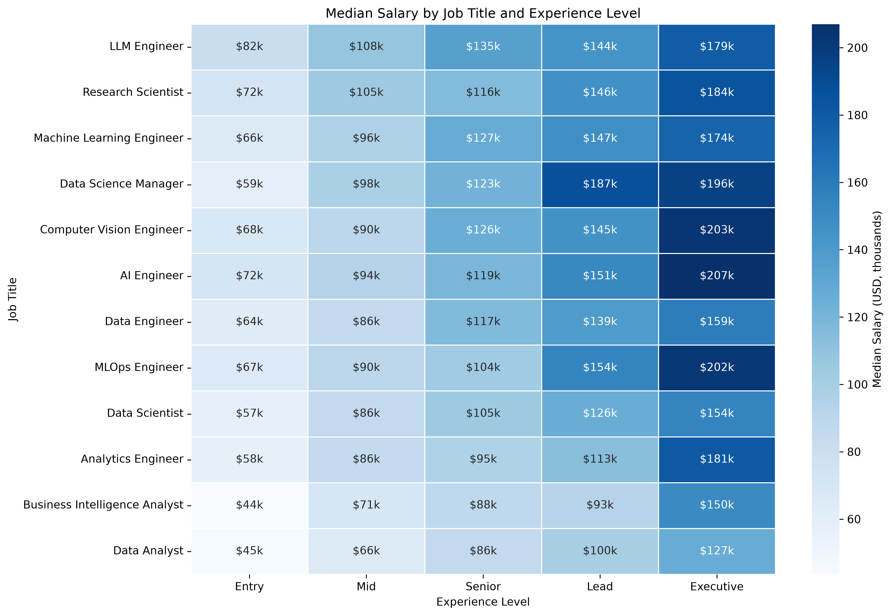
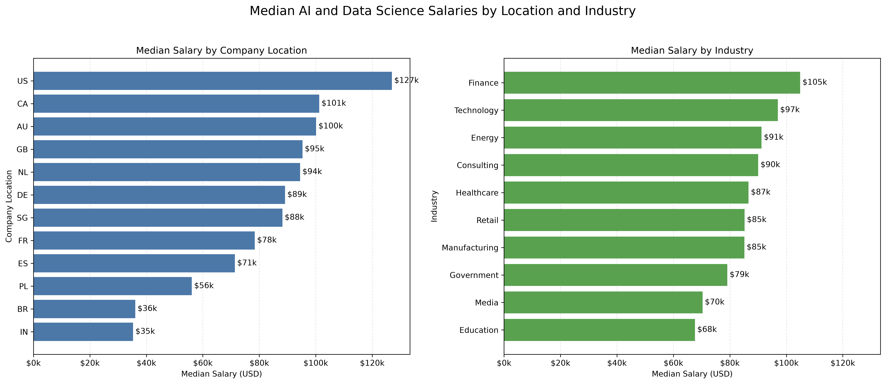
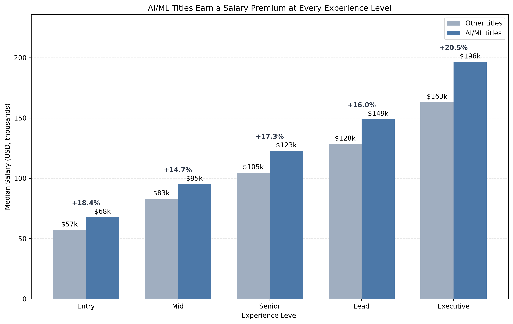
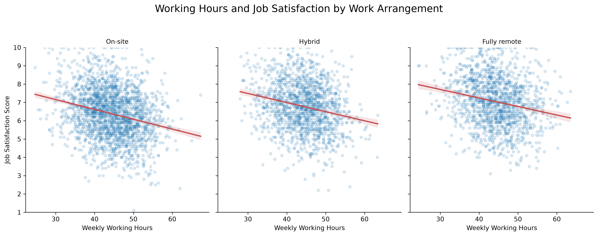
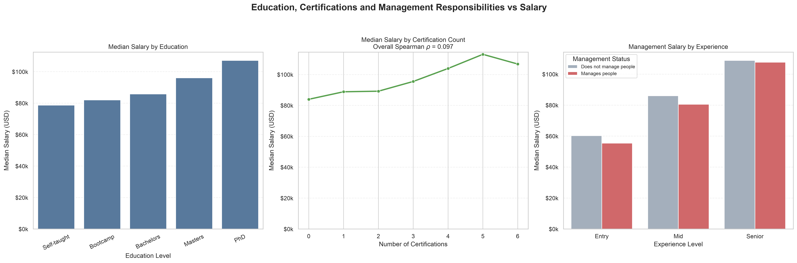

# AI & Data Science Salary Analysis

## Project Overview

This project explores salary patterns across 5,000 AI and data science roles.  
The objective is to identify how factors such as job title, experience, location,
education and remote-working arrangements are associated with salary and job
satisfaction.

The analysis was completed primarily with Python and Pandas.

## Key Findings

- **Job title and experience:**

  - **Job title:** Specialised AI roles generally earned higher median salaries than Data Analyst and Business Intelligence Analyst positions.

  - **Experience:** Median salary increased consistently with experience across every job title.

- **Location and industry:**

  - **Location:** The US had the highest overall median salary ($126,987), while India had the lowest ($35,310). This pattern continued across every experience level, with the US–India gap widening from $60,969 at Entry level to $157,892 at Executive level.

  - **Industry:** Finance had the highest median salary ($104,900), while Education had the lowest ($67,627). Salary varied more across locations than industries, suggesting a stronger association between location and salary.

- **AI and ML salary premium:** 

  - **Premium:** AI Engineer and Machine Learning Engineer roles had median salaries between 14.7% and 20.5% higher than other job titles across all experience levels.

  - **Experience:** The dollar premium increased from $10,529 at Entry level to $33,358 at Executive level, where the highest percentage premium of 20.5% was recorded.

- **Remote work, working hours and satisfaction:**

  - **Work arrangement:** Fully remote employees reported the highest typical job satisfaction, followed by hybrid and on-site employees, despite all three groups working a similar number of weekly hours.

  - **Working hours:** Weekly working hours had a weak negative relationship with job satisfaction across every work arrangement, indicating that employees working longer hours generally reported lower satisfaction.

- **Education, certifications and management:**

  - **Education:** Higher education was consistently associated with higher median salary. PhD holders earned the highest median salary at every experience level, followed by Master's degree holders.

  - **Certifications:** Certification count had only a very weak overall relationship with salary (Spearman's $\rho=0.097$). Within each experience level, the correlations were approximately zero, suggesting that additional certifications were not meaningfully associated with higher salary among similarly experienced employees.

  - **Management:** Employees who managed people had a 47.1% higher median salary overall. However, managers earned slightly less than non-managers within the comparable Entry, Mid and Senior levels. The overall difference therefore appears to reflect the concentration of managers in higher-paying Lead and Executive positions.

This project investigates the following questions:

1. How does salary vary across job titles and experience levels?
2. Which countries and industries offer the highest median salaries?
3. Do AI and machine-learning job titles command a salary premium?
4. How are remote work, working hours and job satisfaction related?
5. Are education, certifications and management responsibilities associated
   with higher salaries?

## Dataset

The dataset contains 5,000 AI and data science employment records with 27
variables.

## Important Variables

| Variable | Description | Type |
|---|---|---|
| `salary_usd` | Annual salary converted to US dollars; primary outcome variable | Numerical |
| `job_title` | Employee’s data or AI-related job title | Categorical |
| `experience_level` | Career level: Entry, Mid, Senior, Lead or Executive | Ordered categorical |
| `company_location` | Country in which the employing company is located | Categorical |
| `industry` | Industry in which the company operates | Categorical |
| `remote_ratio` | Percentage of work completed remotely: 0%, 50% or 100% | Discrete numerical |
| `weekly_hours` | Number of hours worked per week | Numerical |
| `job_satisfaction_score` | Employee-reported job satisfaction score | Numerical |
| `education_level` | Highest education category attained | Ordered categorical |
| `certifications_count` | Number of professional certifications held | Discrete numerical |
| `manages_people` | Whether the employee has people-management responsibilities | Boolean |

### Derived Variables

| Variable | Description |
|---|---|
| `title_group` | Classifies AI Engineer and Machine Learning Engineer as `AI/ML titles`, with all remaining roles classified as `Other titles` |
| `work_arrangement` | Converts `remote_ratio` into `On-site`, `Hybrid` and `Fully remote` categories |
| `management_status` | Converts `manages_people` into readable manager and non-manager categories |

Source: [AI & Data Science Job Salaries 2026 – Kaggle] https://www.kaggle.com/datasets/uditjain13/ai-and-data-science-job-salaries-2026

## Tools Used

| Tool | Purpose |
|---|---|
| **Python** | Performed data cleaning, analysis and visualisation |
| **Pandas** | Manipulated data, created summary tables, groupings and pivot tables |
| **NumPy** | Supported numerical calculations and chart positioning |
| **Matplotlib** | Created and customised portfolio-ready charts |
| **Seaborn** | Produced heatmaps, regression plots and statistical visualisations |
| **SciPy** | Calculated Spearman correlation coefficients |
| **Jupyter Notebook** | Documented and executed the complete analysis workflow |
| **Git and GitHub** | Managed version control and presented the completed project |

## Data Preparation

## Data Preparation

The dataset was prepared in Python using Pandas before analysis:

1. **Data inspection:** Reviewed the dataset’s dimensions, column names, data types, missing values and duplicate records.

2. **Type validation:** Confirmed that salary, weekly hours, satisfaction scores and certification counts were numerical, while variables such as job title, location and industry were categorical.

3. **Category ordering:** Defined logical orders for `experience_level` and `education_level` to ensure tables and charts followed a meaningful progression.

4. **Work-arrangement classification:** Converted `remote_ratio` values of 0%, 50% and 100% into `On-site`, `Hybrid` and `Fully remote`.

5. **AI/ML classification:** Grouped `AI Engineer` and `Machine Learning Engineer` as `AI/ML titles` and classified the remaining positions as `Other titles`.

6. **Management classification:** Converted the Boolean `manages_people` variable into readable manager and non-manager categories.

7. **Summary measures:** Used median salary as the primary measure because it is less sensitive to unusually high salaries than the mean.

8. **Sample-size validation:** Calculated observation counts for grouped comparisons. Results based on small samples were excluded or clearly identified as limitations.

No causal conclusions were drawn because salary and job satisfaction may also be influenced by factors not controlled for in the analysis.

## Exploratory Data Analysis

### How Does Salary Vary Across Job Titles and Experience Levels?

## Salary by Job Title and Experience Level

Median salary generally increased with experience across every job title.
Entry-level median salaries ranged from approximately $43,574 for Business
Intelligence Analysts to $81,994 for LLM Engineers. Executive-level salaries
ranged from approximately $126,739 for Data Analysts to $206,967 for AI
Engineers.

LLM Engineers had the highest median salary at the Entry, Mid and Senior levels.
At higher experience levels, Data Science Managers had the highest Lead-level
median salary, while AI Engineers had the highest Executive-level median salary.
Data Analyst and Business Intelligence Analyst positions were generally the
lowest-paid roles across experience levels.

These results suggest that both seniority and technical specialisation are
associated with higher salaries.

## Location and industry

Median salary varied substantially by company location, with the
US recording the highest median salary at approximately $126,987 and India the
lowest at approximately $35,310. Across industries, Finance had the highest
median salary at $104,900, while Education had the lowest at $67,627. The salary
range across locations was considerably larger than the range across industries,
suggesting that location had a stronger raw association with salary.

## Limitation 
Salary differences between locations may also reflect differences in job title,
seniority, cost of living and industry composition. Therefore, the results
describe associations and should not be interpreted as causal effects.

## Accounting for Experience Levels
Location-related salary differences remained after comparing
employees within the same experience levels. The US had the highest median
salary and India the lowest at every level. The absolute US–India salary gap
also widened from approximately $60,969 at Entry level to $157,892 at Executive
level, indicating that location was strongly associated with salary even after
accounting for broad differences in experience.

## Limitation
Several Lead- and Executive-level location groups had relatively small sample
sizes. Their median salaries may therefore be more sensitive to individual
observations and should not be treated as definitive country rankings.

## AI/ML Premium

AI Engineer and Machine Learning Engineer roles had higher median salaries than other job titles at every experience level. This indicates that AI/ML titles were consistently associated with a salary premium, even after accounting for broad differences in experience.

**Supporting insights:**

- The percentage premium remained positive at every experience level, ranging from 14.7% to 20.5%.
- The absolute salary gap increased consistently with seniority, from $10,529 at Entry level to $33,358 at Executive level.
- Executive roles recorded the highest premium at 20.5%, while Mid-level roles recorded the lowest at 14.7%.
- The percentage premium did not rise consistently with experience, even though the dollar difference increased at every level.
- These results show an association rather than causation because location, industry and other employment characteristics may also influence salary.

### How Are Remote Work, Working Hours and Job Satisfaction Related?

**Finding:** Employees with greater remote-working flexibility reported higher job satisfaction despite working approximately the same number of weekly hours. Longer working hours were weakly associated with lower satisfaction across all three work arrangements.

**Supporting insights:**

- Fully remote employees recorded the highest median satisfaction score at 7.0, compared with 6.8 for Hybrid employees and 6.4 for On-site employees.
- Average satisfaction followed the same pattern: 7.04 for Fully remote, 6.78 for Hybrid and 6.38 for On-site employees.
- Median weekly hours differed by only 0.2 hours across the three groups, indicating that higher remote-worker satisfaction was not explained by fewer working hours.
- The overall correlation between weekly hours and satisfaction was weakly negative at $r=-0.227$.
- The negative relationship appeared across every arrangement: On-site ($r=-0.251$), Hybrid ($r=-0.226$) and Fully remote ($r=-0.211$).
- The association was slightly stronger for On-site employees and weakest for Fully remote employees, although the differences between the correlations were relatively small.
- These findings show associations rather than causation; other factors such as salary, role, seniority and industry may also influence job satisfaction.

### Are Education, Certifications and Management Responsibilities Associated With Higher Salaries?

**Finding:** Education showed the clearest positive association with salary. Certifications showed little relationship with salary after accounting for broad differences in experience. Although managers earned substantially more overall, no management salary premium was observed within comparable experience levels.

**Supporting insights:**

- Median salary increased from $78,712 for Self-taught employees to $107,117 for PhD holders, representing an increase of approximately 36%.
- The overall certification–salary correlation was weakly positive at $\rho=0.097$.
- Within experience levels, certification correlations ranged from $-0.024$ to $0.031$, indicating virtually no monotonic relationship.
- Managers earned an overall median salary of $123,954, compared with $84,275 for non-managers.
- Within comparable levels, the management differences were negative: -8.1% at Entry, -6.4% at Mid and -1.1% at Senior level.
- Lead and Executive comparisons could not be calculated because the dataset contained no non-managers at those levels.
- These findings represent associations and do not establish that education, certifications or management responsibilities cause salary differences.

## Conclusions

1. **Seniority and technical specialisation were strongly associated with salary.** Median salary increased across experience levels for every job title, while specialised roles such as LLM Engineer, AI Engineer and Data Science Manager generally earned more than analyst positions.

2. **Company location showed greater salary variation than industry.** The US had the highest median salary at $126,987, while India had the lowest at $35,310. These differences remained within every experience level, although some senior-level groups had small samples.

3. **AI/ML roles consistently commanded a salary premium.** AI Engineer and Machine Learning Engineer roles earned 14.7%–20.5% more than other titles at comparable experience levels, with the dollar premium increasing from $10,529 at Entry level to $33,358 at Executive level.

4. **Remote flexibility was associated with greater job satisfaction.** Fully remote employees had the highest median satisfaction score at 7.0, compared with 6.8 for Hybrid and 6.4 for On-site employees. Working hours were similar across arrangements but had a weak negative relationship with satisfaction overall ($r=-0.227$).

5. **Education had a clearer salary association than certifications or management responsibilities.** PhD holders earned approximately 36% more than Self-taught employees in median terms. Certification count showed virtually no relationship with salary within experience levels, while the apparent overall management premium disappeared when employees at comparable experience levels were examined.

## Limitations

- The source methodology should be verified before generalising the findings.
- Some country and job-title groups contain fewer observations than others.
- Salary differences may be affected by multiple overlapping variables.
- Equity percentages cannot be converted into monetary compensation without
  company valuation information.
- The analysis identifies associations rather than causal relationships.

