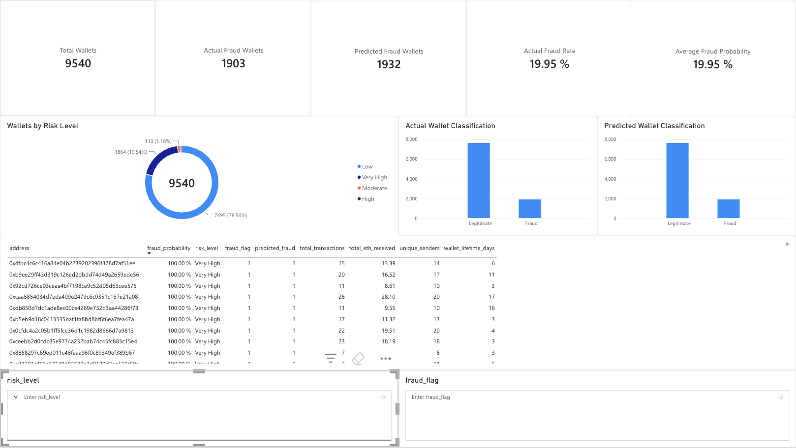
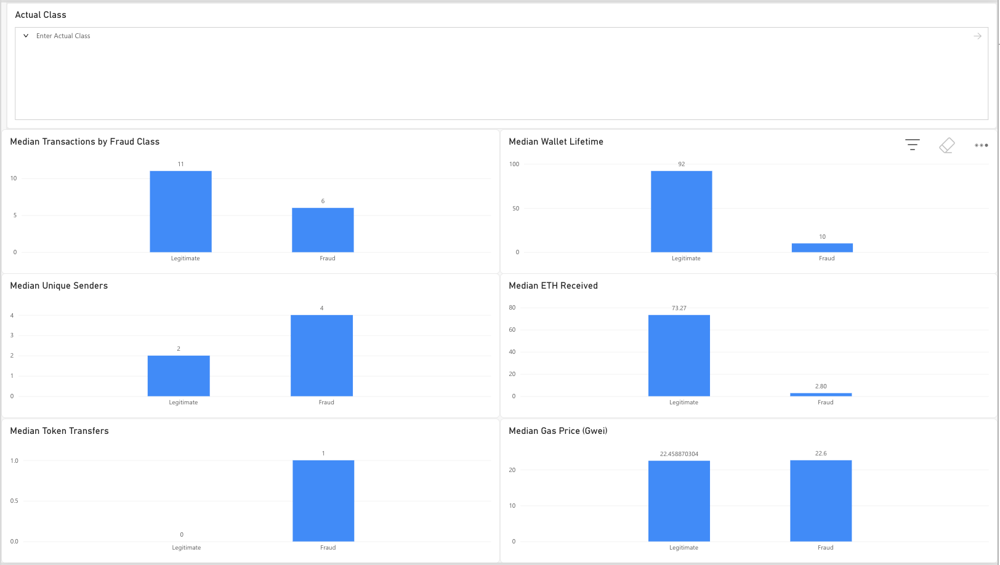
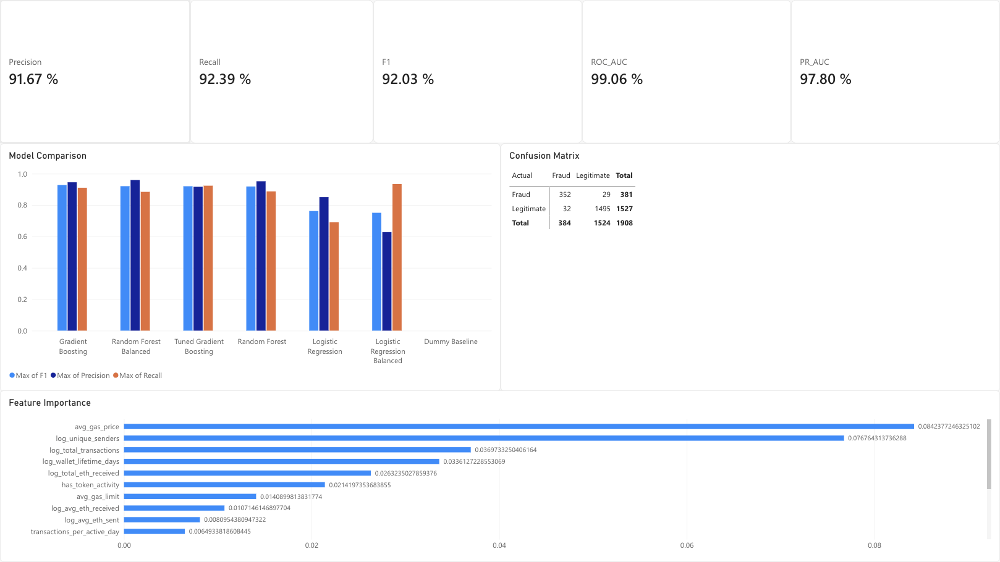

# Ethereum Wallet Fraud Detection & Risk Analytics

End-to-end Web3 analytics and machine learning project for identifying potentially fraudulent Ethereum wallets using raw Ethereum Mainnet activity.

**Pipeline:** BigQuery + SQL → pandas → scikit-learn → Power BI

## Project Highlights

- **9,540 wallets** in the final modelling cohort
- **17 engineered modelling features**
- **Histogram Gradient Boosting** selected as the final classifier
- **92.03% F1**
- **92.39% recall**
- **91.67% precision**
- **99.06% ROC-AUC**
- **97.80% PR-AUC**
- Interactive **3-page Power BI dashboard** for wallet risk, behaviour analysis, and model performance

---

## Project Overview

This project builds an end-to-end Web3 analytics and machine learning pipeline for identifying potentially fraudulent Ethereum wallets.

Externally labelled wallet addresses were combined with raw Ethereum Mainnet blockchain activity. Google BigQuery and SQL were used for data validation and wallet-level feature engineering, pandas was used for exploratory data analysis and preprocessing, and scikit-learn was used to train, compare, tune, and evaluate fraud classification models.

The final model generates wallet-level fraud probabilities and risk classifications that are presented through Power BI.

---

## Project Pipeline

```text
Ethereum Fraud Labels + Ethereum Mainnet Data
                    ↓
              Google BigQuery
                    ↓
          SQL Cleaning & Validation
                    ↓
          SQL Feature Engineering
                    ↓
          pandas EDA & Preprocessing
                    ↓
          scikit-learn Modelling
                    ↓
             Fraud Risk Scoring
                    ↓
             Power BI Dashboard
```

---

## Tools Used

- **Google BigQuery** — Ethereum blockchain querying
- **SQL** — cleaning, validation, joins, aggregation, and feature engineering
- **Python**
- **pandas** — data preparation and exploratory analysis
- **NumPy** — numerical transformations
- **Matplotlib** — exploratory visualisation
- **scikit-learn** — classification, cross-validation, tuning, threshold optimisation, and model evaluation
- **Power BI** — dashboarding and business-facing visualisation

---

# Data Preparation

## Wallet Label Cleaning

The labelled fraud dataset was imported into BigQuery and cleaned before being matched to blockchain activity.

Cleaning steps included:

- Trimming wallet addresses
- Converting wallet addresses to lowercase
- Casting the fraud label to an integer
- Removing missing wallet addresses or labels
- Deduplicating wallet records
- Excluding wallets with contradictory labels
- Validating Ethereum address format

After deduplication:

| Class | Wallets |
|---|---:|
| Legitimate | 7,637 |
| Fraudulent | 2,179 |
| **Total** | **9,816** |

Five malformed Ethereum addresses were subsequently excluded.

---

## Blockchain Coverage Validation

Labelled wallets were matched against multiple Ethereum activity sources:

- Top-level Ethereum transactions
- Token transfers
- EVM execution traces

A historical cutoff was used during feature construction so that future blockchain behaviour was not included for historically labelled wallets.

Final coverage:

| Class | Valid Wallets | Activity Found | Unmatched |
|---|---:|---:|---:|
| Legitimate | 7,637 | 7,637 | 0 |
| Fraudulent | 2,174 | 1,903 | 271 |

Wallets with no observable blockchain activity were excluded instead of being assigned zero activity. Missing blockchain coverage was concentrated in the fraud class, so treating those records as zero-activity wallets could have introduced an artificial predictive signal.

### Final Modelling Population

- **7,637 legitimate wallets**
- **1,903 fraudulent wallets**
- **9,540 wallets total**

---

# SQL Feature Engineering

Wallet-level behavioural features were created directly from Ethereum Mainnet data.

## Transaction Features

Features derived from top-level transactions included:

- Transactions sent
- Transactions received
- Total transactions
- Unique senders
- Unique receivers
- Total ETH sent
- Total ETH received
- Average ETH sent
- Average ETH received
- Maximum ETH sent
- Maximum ETH received
- Average gas limit
- Average gas price
- Active days
- Wallet lifetime
- Transactions per active day

## Token Features

Additional token-transfer features included:

- Token transfers sent
- Token transfers received
- Total token transfers
- Unique tokens interacted with
- Unique token senders
- Unique token receivers
- Token-active days
- Token activity lifetime
- Token transfers per active day

Token quantities were not aggregated across different token contracts because token standards and decimal scales differ.

---

# Exploratory Data Analysis

The final SQL feature table was exported from BigQuery and loaded into pandas.

The dataset contained:

- **9,540 rows**
- **29 initial columns**
- No duplicate wallet addresses

Two variables contained structural missing values:

- `transactions_per_active_day`
- `token_transfers_per_active_day`

These represented wallets with no activity of the corresponding type.

Two indicator variables were therefore created:

- `has_transaction_activity`
- `has_token_activity`

The structural missing values were then filled with zero.

---

## Distribution Analysis

Blockchain activity was highly right-skewed.

For legitimate wallets:

- Median transactions: **11**
- 90th percentile: **382**
- 99th percentile: **55,598**
- Maximum: **15,379,100**

Extreme high-volume wallets were retained because they may represent legitimate real-world blockchain entities. Rather than deleting them arbitrarily, heavily skewed variables were transformed using:

```text
log(1 + x)
```

Log transformations were applied to transaction counts, ETH-flow variables, token activity, counterparties, and wallet activity duration.

---

## Feature Selection

Correlation analysis was used to identify highly redundant predictors.

Several strongly correlated raw and transformed variables were removed or consolidated. After feature selection, **17 predictors** were retained for modelling.

The wallet address was kept only as an identifier and was not used as a machine learning feature.

---

# Machine Learning

The data was split using an **80/20 stratified train-test split**.

A dummy classifier was first established to provide a baseline.

## Dummy Baseline

| Metric | Score |
|---|---:|
| Accuracy | 80.03% |
| Precision | 0.00% |
| Recall | 0.00% |
| F1 | 0.00 |
| ROC-AUC | 0.50 |
| PR-AUC | 0.20 |

The baseline demonstrates why accuracy alone is misleading in an imbalanced fraud-classification problem.

---

## Model Comparison

Models evaluated included:

- Logistic Regression
- Balanced Logistic Regression
- Random Forest
- Balanced Random Forest
- Histogram Gradient Boosting

Initial held-out test performance:

| Model | Accuracy | Precision | Recall | F1 | ROC-AUC | PR-AUC |
|---|---:|---:|---:|---:|---:|---:|
| Logistic Regression | 0.914 | 0.851 | 0.690 | 0.762 | 0.950 | 0.850 |
| Balanced Logistic Regression | 0.876 | 0.628 | 0.934 | 0.751 | 0.953 | 0.821 |
| Random Forest | 0.969 | 0.952 | 0.887 | 0.918 | 0.989 | 0.972 |
| Balanced Random Forest | 0.970 | 0.960 | 0.885 | 0.921 | 0.988 | 0.972 |

Histogram Gradient Boosting produced the strongest cross-validation performance and was selected for tuning.

---

# Cross-Validation

Models were evaluated using **5-fold stratified cross-validation** on the training data.

### Random Forest

| Metric | Mean CV Score |
|---|---:|
| Precision | 0.948 |
| Recall | 0.842 |
| F1 | 0.892 |
| ROC-AUC | 0.988 |
| PR-AUC | 0.965 |

### Histogram Gradient Boosting

| Metric | Mean CV Score |
|---|---:|
| Precision | 0.946 |
| Recall | 0.891 |
| F1 | 0.917 |
| ROC-AUC | 0.992 |
| PR-AUC | 0.976 |

Histogram Gradient Boosting was therefore selected as the final model family.

---

# Hyperparameter Tuning

Randomized search was performed using **PR-AUC** as the optimisation metric.

Best parameters:

```python
{
    "min_samples_leaf": 10,
    "max_leaf_nodes": 63,
    "max_iter": 300,
    "max_depth": 5,
    "learning_rate": 0.08,
    "l2_regularization": 0.0
}
```

The tuned model achieved the following mean cross-validation scores:

| Metric | Mean CV Score |
|---|---:|
| Precision | 0.954 |
| Recall | 0.887 |
| F1 | 0.919 |
| ROC-AUC | 0.992 |
| PR-AUC | 0.977 |

---

# Classification Threshold Optimisation

The default classification threshold of `0.50` was not automatically accepted.

Out-of-fold training probabilities were used to select the threshold that maximised F1.

Selected threshold:

```text
0.300
```

Cross-validated performance at the selected threshold:

- Precision: **92.40%**
- Recall: **92.64%**
- F1: **92.52%**

This threshold was then applied once to the held-out test set for final evaluation.

---

# Final Model Performance

The final tuned Histogram Gradient Boosting model achieved:

| Metric | Held-Out Test Score |
|---|---:|
| Accuracy | **96.80%** |
| Precision | **91.67%** |
| Recall | **92.39%** |
| F1 | **92.03%** |
| ROC-AUC | **99.06%** |
| PR-AUC | **97.80%** |

### Confusion Matrix

| | Predicted Fraud | Predicted Legitimate |
|---|---:|---:|
| **Actual Fraud** | 352 | 29 |
| **Actual Legitimate** | 32 | 1,495 |

This corresponds to:

- **352 true positives**
- **1,495 true negatives**
- **32 false positives**
- **29 false negatives**

The model identified more than 92% of fraudulent wallets while maintaining precision above 91%.

---

# Model Interpretation

Permutation importance was calculated using PR-AUC to estimate which variables contributed most strongly to model discrimination.

| Feature | Permutation Importance |
|---|---:|
| Average Gas Price | 0.0842 |
| Unique Senders | 0.0768 |
| Total Transactions | 0.0370 |
| Wallet Lifetime | 0.0336 |
| Total ETH Received | 0.0263 |
| Token Activity Indicator | 0.0214 |

The final model therefore relied on a combination of:

- Transaction-cost behaviour
- Counterparty structure
- Transaction volume
- Wallet longevity
- ETH flow
- Token activity

Permutation importance measures predictive contribution and should not be interpreted as evidence that any feature causes fraudulent behaviour.

---

# Power BI Dashboard

The final project outputs were presented through a three-page Power BI dashboard.

## Page 1 — Wallet Risk Overview

The first page provides an operational overview of wallet-level fraud risk.

### Key Metrics

- **Total wallets:** 9,540
- **Actual fraud wallets:** 1,903
- **Predicted fraud wallets:** 1,932
- **Actual fraud rate:** 19.95%
- **Average fraud probability:** 19.95%

The page also includes:

- Wallet distribution by risk level
- Actual wallet classification
- Predicted wallet classification
- Ranked high-risk wallet table
- Fraud probability
- Transaction activity
- ETH received
- Unique senders
- Wallet lifetime



---

## Page 2 — Wallet Behaviour Analysis

The second page compares median blockchain behaviour between legitimate and fraudulent wallets.

Median statistics were used rather than averages because blockchain activity was heavily affected by extreme high-volume wallets.

| Behaviour | Legitimate | Fraudulent |
|---|---:|---:|
| Median Transactions | 11 | 6 |
| Median Wallet Lifetime | 92 days | 10 days |
| Median Unique Senders | 2 | 4 |
| Median ETH Received | 73.27 ETH | 2.80 ETH |
| Median Token Transfers | 0 | 1 |
| Median Gas Price | ~22.46 Gwei | ~22.60 Gwei |

The behavioural analysis shows that fraudulent wallets in this modelling cohort generally:

- Had shorter operating lifetimes
- Performed fewer total transactions
- Received considerably less ETH
- Interacted with more unique senders at the median
- Were more likely to exhibit token-transfer activity

Median gas price was similar between the two classes even though gas-price behaviour was highly informative to the nonlinear model.



---

## Page 3 — Model Performance

The third page presents model comparison, held-out test performance, the confusion matrix, and permutation feature importance.

Final model metrics displayed in Power BI:

- Precision: **91.67%**
- Recall: **92.39%**
- F1: **92.03%**
- ROC-AUC: **99.06%**
- PR-AUC: **97.80%**



---

# Key Findings

## 1. Fraudulent wallets had much shorter operating lifetimes

The median legitimate wallet was active for approximately **92 days**, compared with only **10 days** for fraudulent wallets.

## 2. Fraudulent wallets had lower overall transaction activity

Median transaction counts were:

- Legitimate: **11**
- Fraudulent: **6**

The upper tail was extremely skewed, particularly among legitimate wallets.

## 3. Fraudulent wallets interacted with more unique senders

The median fraudulent wallet interacted with approximately **4 unique senders**, compared with **2** for legitimate wallets.

The transformed unique-sender feature was also the second most important predictor according to permutation importance.

## 4. Legitimate wallets received substantially more ETH

Median ETH received was approximately:

- Legitimate: **73.27 ETH**
- Fraudulent: **2.80 ETH**

ETH-flow variables remained informative after log transformation.

## 5. Token activity helped distinguish fraudulent behaviour

The median legitimate wallet recorded no token transfers, while the median fraudulent wallet recorded approximately one.

The binary token-activity indicator also ranked among the most influential predictive variables.

## 6. Median statistics were more informative than raw averages

The median legitimate wallet completed only **11 transactions**, while the most active legitimate wallet recorded more than **15 million transactions**.

For this reason:

- Median statistics were prioritised for behavioural analysis
- Log transformations were applied before modelling
- Extreme high-volume wallets were retained rather than arbitrarily removed

## 7. Nonlinear models substantially outperformed Logistic Regression

Logistic Regression achieved an F1 score of approximately **0.76**, while Random Forest reached approximately **0.92** on the held-out test set.

Histogram Gradient Boosting produced the strongest cross-validation performance and was selected as the final model.

## 8. Threshold optimisation improved the precision-recall trade-off

Using out-of-fold training predictions, the classification threshold was reduced from the default `0.50` to approximately `0.30`.

The final held-out model achieved:

- Precision: **91.67%**
- Recall: **92.39%**
- F1: **92.03%**

---

# Project Outcome

This project demonstrates a complete analytics workflow spanning:

**Raw blockchain data → SQL → pandas → machine learning → Power BI**

The project involved:

- Querying Ethereum Mainnet data through Google BigQuery
- Integrating externally labelled fraud addresses
- Investigating incomplete blockchain coverage across multiple Ethereum data layers
- Engineering wallet-level behavioural features using SQL
- Performing EDA and preprocessing with pandas
- Handling highly skewed blockchain distributions
- Comparing linear, bagged-tree, and boosting classifiers
- Performing stratified cross-validation
- Conducting hyperparameter tuning
- Optimising the fraud classification threshold
- Evaluating performance on a held-out test set
- Calculating permutation feature importance
- Generating wallet-level fraud probabilities
- Presenting model outputs through an interactive Power BI dashboard

---


